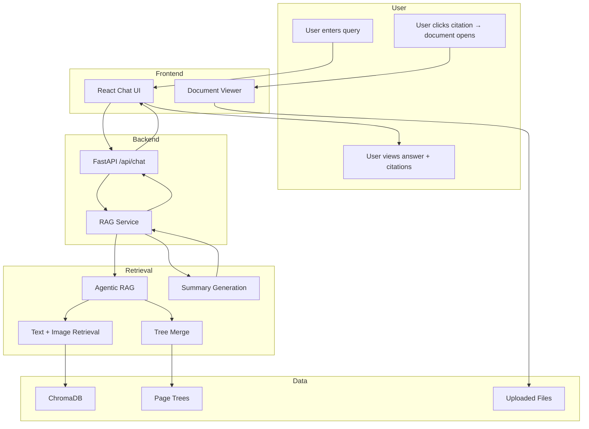
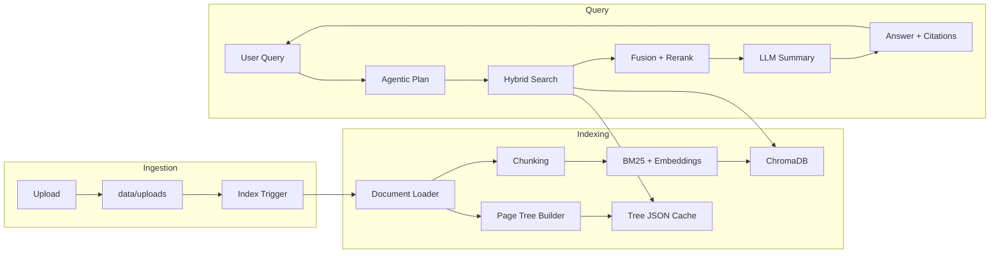
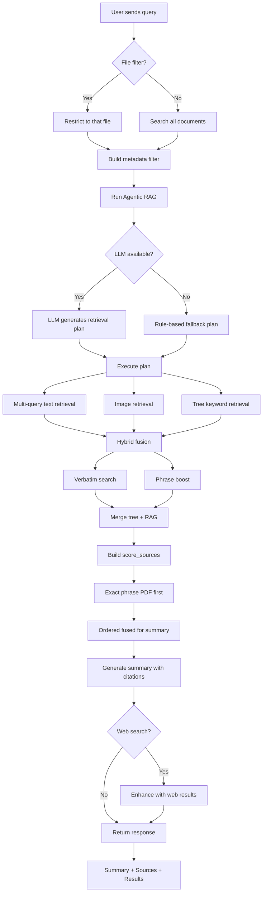
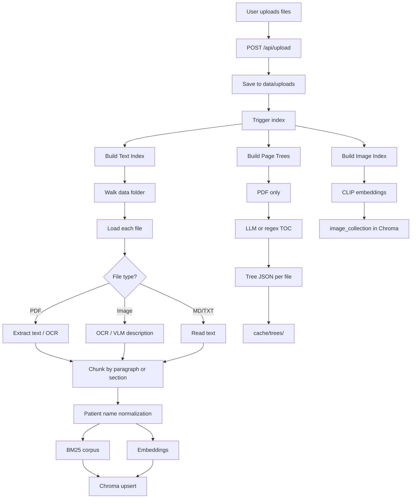
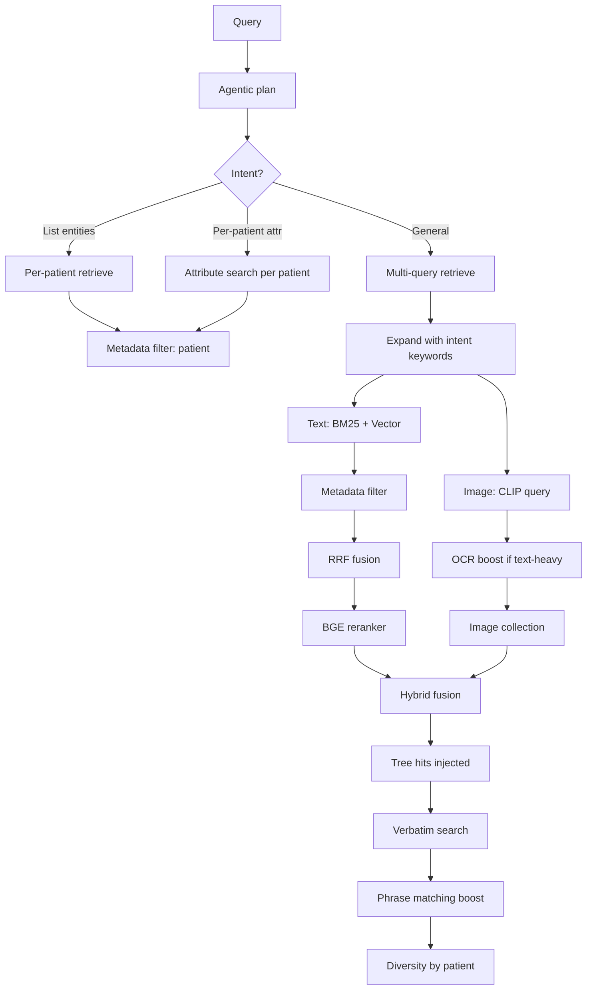
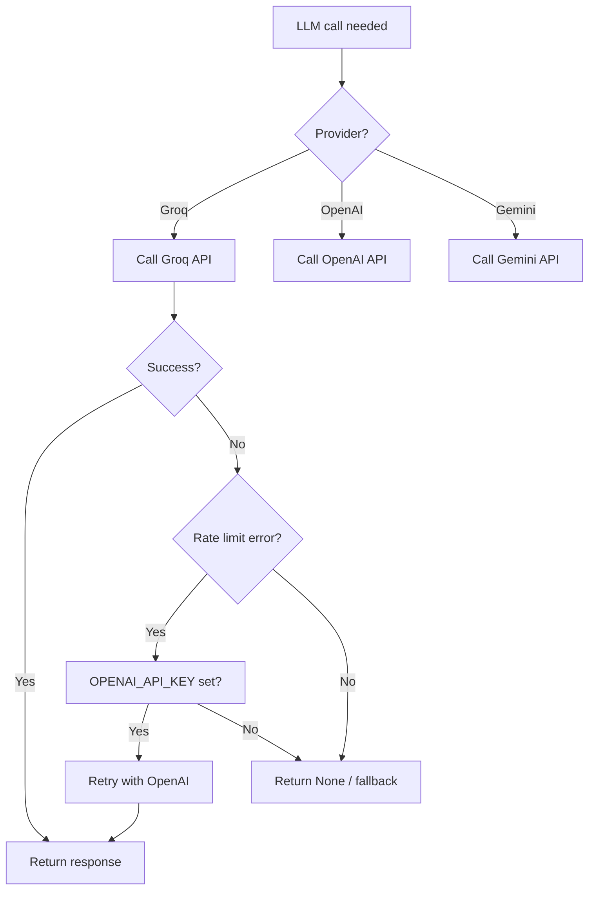
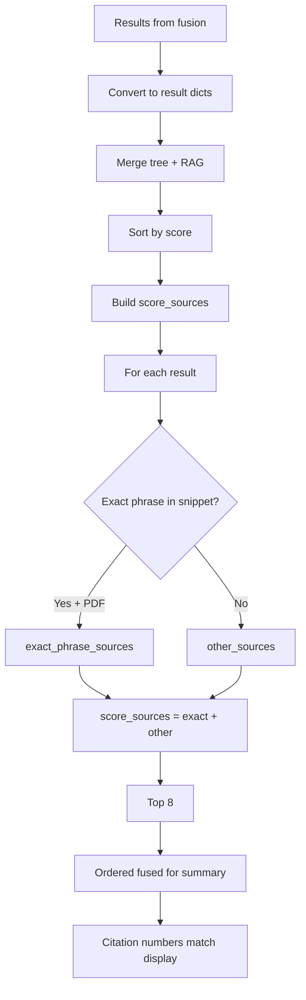

# ISR — Project Documentation

**Internal Search and Retrieval (ISR)** is a document-based AI chat platform that lets users search across PDFs, images, markdown, and text files and get answers grounded in cited sources.

---

## Table of Contents

1. [Technology Stack](#technology-stack)
2. [Project Architecture](#project-architecture)
3. [High-Level Flow](#high-level-flow)
4. [Detailed Flows](#detailed-flows)
5. [Configuration](#configuration)

---

## Technology Stack

### Frontend

| Category | Technology |
|----------|------------|
| Framework | React 19 |
| Language | TypeScript |
| Build | Vite 8 |
| Styling | Tailwind CSS 4 |
| Markdown | react-markdown, remark-gfm |
| Icons | lucide-react |
| Utilities | clsx, tailwind-merge, class-variance-authority |

### Backend (API)

| Category | Technology |
|----------|------------|
| Framework | FastAPI |
| Server | Uvicorn |
| Environment | python-dotenv |

### Search and Retrieval

| Category | Technology |
|----------|------------|
| Keyword Search | BM25 (rank-bm25) |
| Semantic Search | sentence-transformers, PyTorch |
| Embedding Model | all-MiniLM-L6-v2 (or BGE-M3) |
| Vector Store | ChromaDB |
| Reranking | BGE CrossEncoder (BAAI/bge-reranker-base) |
| Image Embeddings | CLIP (openai/clip-vit-large-patch14) |

### Document Processing

| Category | Technology |
|----------|------------|
| PDF Text | pdfplumber, PyMuPDF (fitz) |
| OCR | pytesseract (Tesseract), Mistral OCR API |
| Image Conversion | pdf2image, Pillow |
| Structured Conversion | Docling |

### LLM and External APIs

| Category | Technology |
|----------|------------|
| Primary LLM | Groq (llama-3.3-70b-versatile) |
| Fallback LLM | OpenAI (gpt-4o-mini) |
| Other | Google Gemini |
| Web Search | DuckDuckGo Search |

---

## Project Architecture

### Directory Structure

```
├── backend/           # FastAPI API server
│   ├── main.py        # App entry point
│   ├── routes/        # Chat, documents, upload, index, medical
│   └── services/      # RAG service, web search
├── frontend/          # React SPA
│   └── src/           # App, hooks, components, lib
├── indexing/          # Text index, image index, page trees
├── retrieval/         # Agentic RAG, hybrid fusion, reranking
├── data/              # Runtime data
│   ├── uploads/       # Uploaded files
│   ├── chroma/        # Vector store
│   └── cache/trees/    # Cached page trees
├── config.py          # Central configuration
├── document_loader.py # Chunking, OCR, metadata
├── search_index.py    # BM25, Chroma, hybrid search
└── llm_insight.py    # LLM helpers for medical/vision
```

### Component Roles

| Component | Role |
|-----------|------|
| **Frontend** | Chat UI, document viewer, source citations, medical panel |
| **Backend** | REST API for chat, documents, upload, index |
| **RAG Service** | Orchestrates retrieval, summary generation, source ranking |
| **Agentic RAG** | LLM-based query planning, multi-query retrieval |
| **Search Index** | BM25 + vector + hybrid search, reranking |
| **Indexing** | Text chunks, image embeddings, page trees |
| **Page Tree** | Hierarchical PDF structure, keyword retrieval, summaries |

---

## High-Level Flow

### End-to-End Flow



### Data Flow: Upload to Answer



---

## Detailed Flows

### Chat Flow



### Document Upload and Index Flow



### RAG Retrieval Flow



### Summary and Citation Flow

```mermaid
flowchart TD
    A[Top 8 results] --> B[Score sources order]
    B --> C[Exact phrase PDF first]
    C --> D[Other sources]

    D --> E[Build ordered fused]
    E --> F[Map to content for LLM]

    F --> G[Labeled excerpts]
    G --> H[Source 1: file p.X]
    G --> I[Source 2: file p.Y]
    G --> J[...]

    H --> K[LLM prompt]
    I --> K
    J --> K

    K --> L[Summary with [1] [2] citations]
    L --> M[Return sources list]

    M --> N[Frontend renders]
    N --> O[Clickable citation buttons]
    O --> P[Opens document viewer]
```

### Groq to OpenAI Fallback Flow



### Source Ranking for Display



---

## Configuration

### Environment Variables

| Variable | Purpose |
|----------|---------|
| CLAIM_SEARCH_DATA | Override data root folder |
| GROQ_API_KEY | Primary LLM (Groq) |
| OPENAI_API_KEY | Fallback LLM, vision |
| GEMINI_API_KEY / GOOGLE_API_KEY | Alternative LLM |
| MISTRAL_API_KEY / MISTRAL_OCR_API_KEY | OCR and document processing |
| VECTOR_BACKEND | chroma or faiss |
| CHROMA_PERSIST_DIR | Chroma storage path |

### Config Module (config.py)

| Section | Parameters |
|---------|------------|
| Paths | DATA_FOLDER, UPLOADS_SUBDIR |
| Chunking | CHUNK_BY, MAX_CHUNK_CHARS, MIN_CHUNK_CHARS |
| Search | BM25_TOP_K, VECTOR_TOP_K, HYBRID_TOP_K, RRF_K |
| Reranker | RERANKER_MODEL, RERANKER_CANDIDATES |
| Metadata | AUTO_METADATA_FILTER, PREFER_USER_METADATA_FILTER |
| Diversity | METADATA_DIVERSITY_ENABLED, METADATA_DIVERSITY_MAX_PER_ENTITY |
| Embeddings | EMBEDDING_MODEL |
| Chroma | CHROMA_PERSIST_DIR, collection names |
| Multimodal | CLIP model, hybrid weights, image collection |

### Frontend Configuration

- API base: same-origin `/api` (Vite proxy to backend on port 8000)
- Dev server: port 3001 (or 3000)
- Backend: port 8000

---

## Key Features

### Chat

- Natural language queries over all indexed documents
- Optional file filter when starting from a single document
- Optional patient filter for medical documents
- Optional web search for external information
- Citations linking text to source documents and pages

### Document Viewer

- PDF pages as images
- Markdown/text with search-based scroll
- Image preview
- Multiple documents in tabs
- Highlighting of cited content

### Source Citations

- Inline citation markers in the summary
- Clickable citation buttons that open the document viewer
- Source chips with file name and page
- Expandable list of all retrieved chunks

### Medical Panel

- Patient list from index and folder structure
- Patient-specific documents
- Image-based medical reports
- AI analysis of selected images

### Documents Page

- Upload and delete files
- Index documents or images
- Start a chat limited to a specific file

---

## Run Modes

| Mode | Command | Description |
|------|---------|-------------|
| FastAPI + React | run_app.sh or uvicorn + npm run dev | Primary production-style stack |
| Streamlit | run.sh or streamlit run app.py | Legacy prototype UI |

---

## Summary

This documentation describes the ISR project: technologies, architecture, flows, and configuration. For implementation details, refer to the source code and existing docs in the `docs/` folder.
